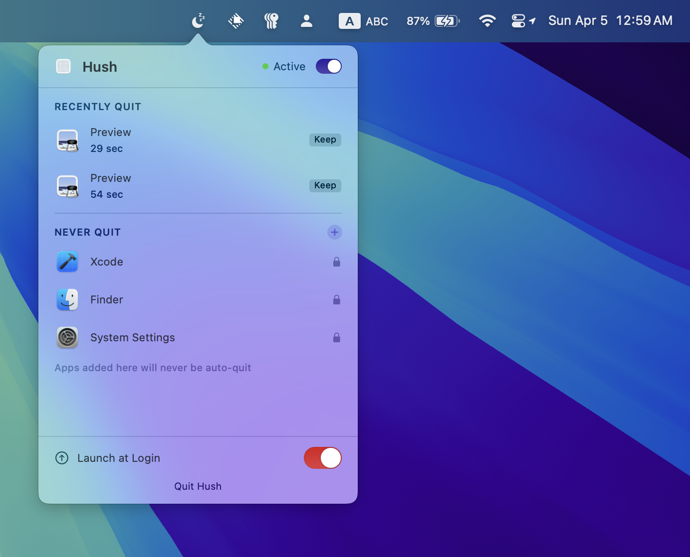
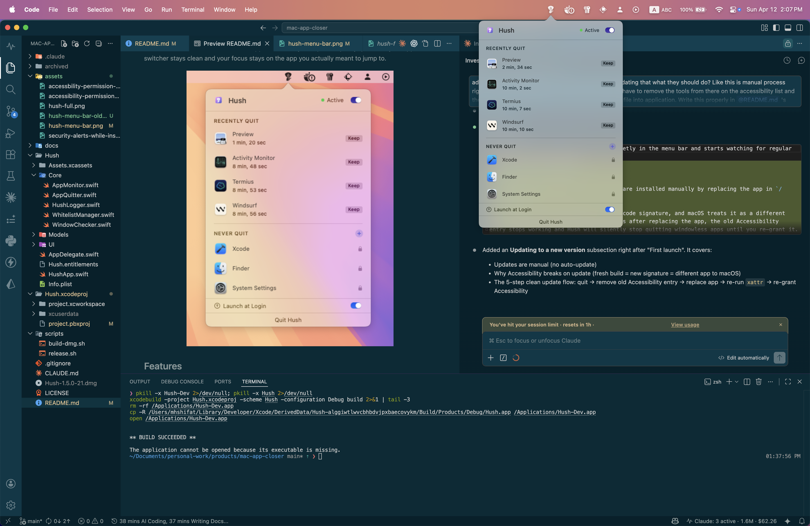
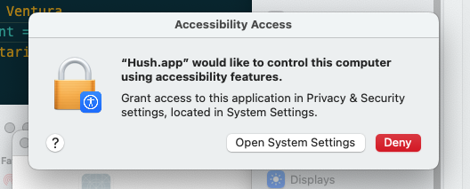
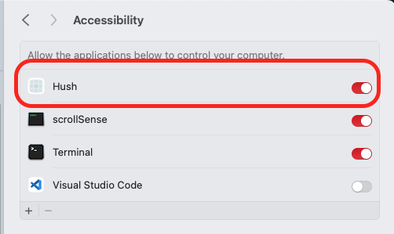

# Hush

> Silently quits macOS apps when their last window is closed.

On macOS, closing the last window often does not actually close the app. It keeps hanging around in `Cmd+Tab`, steals a slot in your app switcher, and gets in the way when you are flying across apps with keyboard shortcuts.

Hush removes that friction. When an app is effectively done, Hush quietly quits it so your app switcher stays clean and your focus stays on the app you actually meant to jump to.

<p align="center">
  
</p>

## Features

- Auto-quits windowless apps within ~1 second
- Keeps `Cmd+Tab` focused on apps you are actually using
- Never quits background-only apps (Docker, Dropbox, etc.)
- Whitelist — protect apps you want to keep running
- Recently Quit list with "Keep" button to undo
- Launch at Login
- 0% CPU, ~130MB RAM at idle

<p align="center">
  
</p>

## Requirements

- macOS 13 Ventura or later
- Accessibility permission (for window counting)

## Installation

### Download

Grab the latest `.dmg` from [Releases](https://github.com/jspw/Hush/releases).

1. Double-click the downloaded DMG — a window opens showing `Hush.app`.
2. Drag `Hush.app` into `/Applications` (use the Applications shortcut in the DMG window).
3. Open **Terminal** and run:

```bash
xattr -dr com.apple.quarantine /Applications/Hush.app
```

4. Go to `/Applications` in Finder, right-click `Hush.app`, and choose **Open**.
5. If macOS still shows a warning dialog, click **Open** to confirm.

> **Why the Terminal step?** macOS quarantines apps downloaded from the internet and may silently delete unnotarized apps copied to `/Applications`. The `xattr` command strips that quarantine flag so macOS leaves the app in place. Once removed, Hush will also appear in your app drawer's Applications section and **Launch at Login** will work correctly across restarts.

### Why macOS says Hush can't be verified

Hush is currently distributed without Apple notarization, so macOS may warn that it "can't verify" the app the first time you open it.

Notarizing a macOS app for public distribution requires enrollment in the [Apple Developer Program](https://developer.apple.com/programs/), which Apple currently lists at **99 USD per membership year** in the U.S. Pricing can vary by region. For a free open-source utility, that recurring cost does not make much sense right now.

If you are cautious about running an unsigned app, that is completely reasonable. Hush is open source, so you can inspect the code yourself, build it from source, and decide whether you trust it before running it.

### First launch

Hush needs **Accessibility** permission to work.

That permission is required because Hush monitors whether apps still have open windows. Without Accessibility access, macOS will not let Hush inspect window state, so it cannot safely decide when an app should be quit.

1. When macOS prompts you, allow the app to open Accessibility settings.

<p align="center">
  
</p>

2. Open **System Settings → Privacy & Security → Accessibility**, then enable Hush.

<p align="center">
  
</p>

Once permission is granted, Hush sits quietly in the menu bar and starts watching for regular apps with zero open windows.

## How it works

Hush lives in your menu bar and watches for regular apps that no longer have any open windows. When you close the last window and move on, Hush detects that state within about a second and calls `terminate()` automatically. Apps that are intentionally backgrounded, like Docker or Dropbox, are left alone.

## Why not App Store?

The App Store requires sandboxing, which blocks the Accessibility API Hush depends on to count windows. Direct download only.

## Releasing

Build the release artifact:

```bash
./scripts/build-dmg.sh 1.0.0
```

Publish the GitHub release after the DMG already exists:

```bash
./scripts/release.sh
```

## Contributing

PRs welcome. Open an issue first for large changes.

## License

MIT
